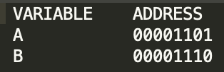
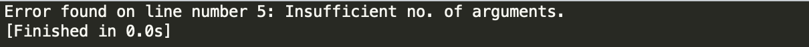

## Course: CSE112 Computer Organization at IIITD

### Project Members:

1. Bhaskar Gupta
2. Rishav Kumar

### Assumptions:

1. Clear Accumulator(CLR) clears the accumulator. No address and value is present after clearing the accumulator.
2. Comments could be added using **"//"**. They are removed by the assembler for conversion to machine code.
3. No macros and procedures are to be assembled.
4. No literals are to be handled.
5. Only the opcodes given should be used. All these opcodes are pre-added as a dictionary in the program and are not read from a separate file.
6. Label cannot be an opcode and vice-versa.
7. Variable cannot be an opcode and vice-versa.
8. Label cannot be a variable and vice-versa.
9. Variable should only be defined once.
10. Number of instructions should not exceed 256 or else it will give an error.

### Opcode Table

### Assembly Test Code

### Variable Table

### Label Table

### Machine Code

### Error Handling

#### 1. More than one opcode in Instruction

**INP and DSP** both are opcodes. But, a instruction cannot have more than one opcode so it will throw an error. 

#### 2. Label Name cannot be a Symbol Name
If we use a symbol name as a label name, it will throw an error as shown.

#### 3. More than one Symbol provided
If we provide more than one symbol to an instruction, it will throw this error as shown.

#### 4. More than one Label provided
If we provide more than one label to an instruction, it will throw this error as shown.

#### 5. No Opcode found in a Instruction
Each instruction should have an opcode but if it does not have one then it will give this error.

#### 6. Insufficient Number of Arguments 
If an opcode requires a variable and you don't provide it with a variable then it will throw this error.

#### 7. Formatting Error(Opcode occur after arguments in a Instruction)
If variable is used before the opcode in an instruction then it will give the following error.

#### 8. Label Name cannot be a Opcode
If label name is an opcode than it will give the following output. 

#### 9. Memory Limit Exceeded
Overload triggered by more commands and variables processed than the maximum limit. Our assembler limit is 256 (0–255).

### Pseudo Code
#### First Pass
If the first pass ends successfully, then only the second pass is executed. 

#### Second Pass
